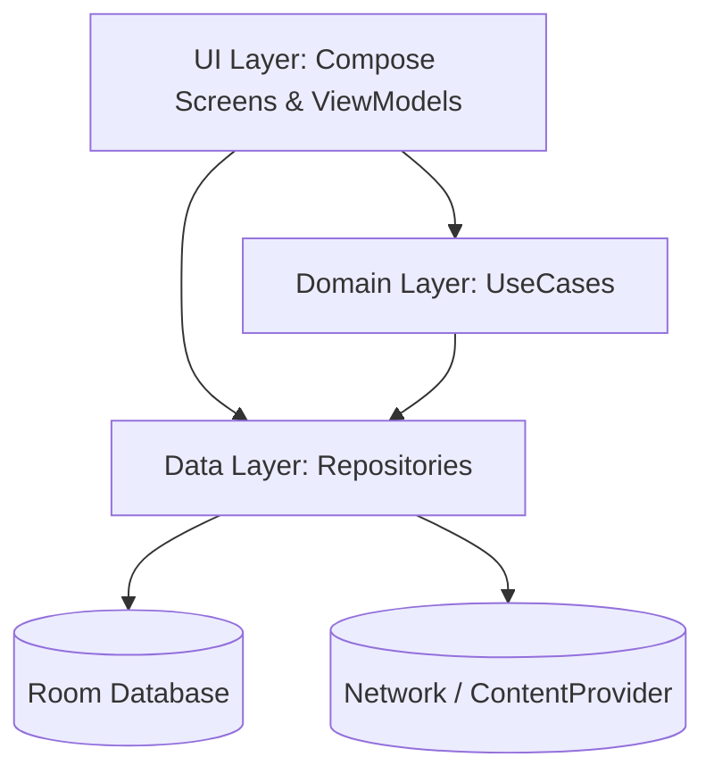

# 架构设计 (Architecture)

本工程采用 **Clean Architecture** 的思想与 **MVVM/MVI** 结合的设计，职责划分严格清晰。

## 1. 核心分层



### UI 层 (Presentation)
- **UI 组件**: 使用 Jetpack Compose，所有设计遵循统一的 `Theme` Token (如 `Color`, `Spacing`, `Typography`)。
- **状态管理**: 采用 `StateFlow` 进行单向数据流 (Unidirectional Data Flow) 管理。ViewModel 暴露 `UiState`，并响应用户的 `Event`。

### 领域层 (Domain)
- **UseCases**: 将复杂的、涉及多个 Repository 的业务逻辑抽离。例如 `PlayerControlUseCase` 统筹 `MusicService` 的操作状态。

### 数据层 (Data)
- **Repositories**: 单一职责。`SongRepository` 负责本地媒体扫描，`LyricsRepository` 负责网络请求和数据库缓存，`ArtworkRepository` 负责封面获取。
- **持久化**: 使用 Room Database，所有的跨版本升级必须编写 `MigrationTest` 保证安全。

## 2. 依赖注入 (DI)
全程使用 **Hilt** 进行依赖注入：
- `@Singleton` 用于跨组件共享的服务 (如 Repositories)
- `@ViewModelScoped` 用于页面级别的依赖

## 3. 播放服务体系
```text
PlayerControls (Compose) 
   -> PlayerViewModel 
      -> PlayerControlUseCase 
         -> MediaController (Media3) 
            -> MusicService (MediaLibraryService)
```
通过 Media3，UI 组件只需与 `MediaController` 通信，完全解耦服务端的后台生命周期与媒体焦点管理。
