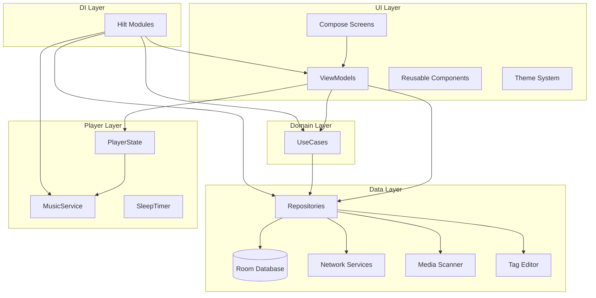

# 架构设计

本文档详细描述 Muse 音乐播放器的架构设计，包括分层结构、依赖注入、状态管理和导航系统。

## 整体架构图



## 分层说明

### UI 层 (Presentation)

UI 层负责界面展示和用户交互，采用 Jetpack Compose 构建。

```
ui/
├── animation/          # 动画定义
├── components/         # 可复用组件
│   ├── FormatBadge.kt
│   ├── LyricsView.kt
│   ├── MiniPlayer.kt
│   └── SongListItem.kt
├── haptic/             # 触觉反馈
├── modifier/           # 自定义 Modifier
├── navigation/         # 导航定义
├── screens/            # 页面
│   ├── home/
│   ├── library/
│   ├── player/
│   └── settings/
├── state/              # UI 状态管理
└── theme/              # 主题系统
    ├── Color.kt
    ├── Shape.kt
    ├── Spacing.kt
    ├── Theme.kt
    └── Type.kt
```

#### 状态管理

采用 **单向数据流 (UDF)** 模式：

```kotlin
// ViewModel 暴露 StateFlow
@HiltViewModel
class PlayerViewModel @Inject constructor(
    private val playerControlUseCase: PlayerControlUseCase
) : ViewModel() {
    private val _uiState = MutableStateFlow(PlayerUiState())
    val uiState: StateFlow<PlayerUiState> = _uiState.asStateFlow()

    // 处理用户事件
    fun onPlayPause() {
        playerControlUseCase.togglePlayPause()
    }
}
```

```kotlin
// UI 状态数据类
data class PlayerUiState(
    val isPlaying: Boolean = false,
    val currentSong: Song? = null,
    val progress: Float = 0f,
    val lyrics: LyricsState = LyricsState.Loading
)
```

### Domain 层

Domain 层包含业务逻辑，通过 UseCase 封装复杂的跨 Repository 操作。

```
domain/
└── usecase/
    ├── ApplyMetadataUseCase.kt
    ├── DeleteSongUseCase.kt
    ├── EditSongMetadataUseCase.kt
    ├── FetchLyricsUseCase.kt
    ├── PlayerControlUseCase.kt
    ├── RestoreSessionUseCase.kt
    ├── ScanAllSongsUseCase.kt
    ├── ScanFolderUseCase.kt
    ├── SearchMetadataUseCase.kt
    └── SetSleepTimerUseCase.kt
```

#### UseCase 示例

```kotlin
class FetchLyricsUseCase @Inject constructor(
    private val lyricsRepository: LyricsRepository
) {
    suspend operator fun invoke(songId: Long, title: String, artist: String): Result<LyricsResult> {
        return try {
            val result = lyricsRepository.fetchLyrics(songId, title, artist)
            Result.success(result)
        } catch (e: Exception) {
            Result.failure(e)
        }
    }
}
```

### Data 层

Data 层负责数据的获取、存储和管理。

```
data/
├── database/           # Room 数据库
│   ├── Database.kt
│   ├── SongEntity.kt
│   ├── AlbumEntity.kt
│   ├── ArtistEntity.kt
│   ├── LyricsEntity.kt
│   ├── LyricsOffsetEntity.kt
│   └── *Dao.kt
├── model/              # 领域模型
│   └── Models.kt
├── network/            # 网络服务
│   ├── LyricsFetcher.kt
│   ├── MetadataFetcher.kt
│   ├── NeteaseLyricsSource.kt
│   └── LrcParser.kt
├── repository/         # 数据仓库
│   ├── ArtworkRepository.kt
│   ├── LyricsRepository.kt
│   ├── MusicRepository.kt
│   └── SongRepository.kt
├── scanner/            # 媒体扫描
│   └── MediaStoreScanner.kt
└── tag/                # 标签读写
    ├── DefaultCoverGenerator.kt
    ├── MetadataFileWriter.kt
    └── TagEditor.kt
```

#### Repository 模式

```kotlin
@Singleton
class SongRepository @Inject constructor(
    private val songDao: SongDao,
    private val scanner: MediaStoreScanner,
    @ApplicationContext private val context: Context
) {
    private val _songs = MutableStateFlow<List<Song>>(emptyList())
    val songs: StateFlow<List<Song>> = _songs.asStateFlow()

    suspend fun scanAll(): List<Song> {
        val scanned = scanner.scanAll()
        songDao.deleteAll()
        songDao.insertAll(scanned.map { it.toEntity() })
        _songs.value = scanned
        return scanned
    }
}
```

## 依赖注入

使用 **Hilt** 进行依赖注入，遵循以下原则：

- `@Singleton`: 跨组件共享的服务（Repository、Database、PlayerState）
- `@ViewModelScoped`: 页面级别的依赖
- `@Provides`: 第三方库或无法直接注入的类

### AppModule

```kotlin
@Module
@InstallIn(SingletonComponent::class)
object AppModule {
    @Provides
    @Singleton
    fun provideDatabase(@ApplicationContext context: Context): MuseDatabase =
        MuseDatabase.getInstance(context)

    @Provides
    fun provideSongDao(db: MuseDatabase): SongDao = db.songDao()

    @Provides
    @Singleton
    fun providePlayerState(): PlayerState = PlayerState()

    @Provides
    @Singleton
    fun provideLyricsFetcher(): LyricsFetcher = LyricsFetcher.getInstance()
}
```

### 注入示例

```kotlin
@Singleton
class LyricsRepository @Inject constructor(
    private val lyricsDao: LyricsDao,
    private val lyricsFetcher: LyricsFetcher
) {
    // ...
}
```

## 状态管理

### 播放器状态

```kotlin
class PlayerState {
    private val _currentSong = MutableStateFlow<Song?>(null)
    val currentSong: StateFlow<Song?> = _currentSong.asStateFlow()

    private val _isPlaying = MutableStateFlow(false)
    val isPlaying: StateFlow<Boolean> = _isPlaying.asStateFlow()

    private val _progress = MutableStateFlow(0f)
    val progress: StateFlow<Float> = _progress.asStateFlow()
}
```

### UI 状态流

```
用户操作 → ViewModel → UseCase/Repository → 数据更新
    ↓
StateFlow 更新 → Compose 重组 → UI 更新
```

## 导航

使用 Jetpack Navigation Compose 进行页面导航。

### 导航图定义

```kotlin
sealed class Screen(val route: String) {
    data object Home : Screen("home")
    data object Library : Screen("library")
    data object Player : Screen("player")
    data object Settings : Screen("settings")
}
```

### NavHost 配置

```kotlin
@Composable
fun MuseNavHost(
    navController: NavHostController,
    innerPadding: PaddingValues
) {
    NavHost(
        navController = navController,
        startDestination = Screen.Home.route
    ) {
        composable(Screen.Home.route) {
            HomeScreen(innerPadding = innerPadding)
        }
        composable(Screen.Library.route) {
            LibraryScreen(innerPadding = innerPadding)
        }
        composable(Screen.Player.route) {
            PlayerScreen(
                innerPadding = innerPadding,
                onBack = { navController.popBackStack() }
            )
        }
        composable(Screen.Settings.route) {
            SettingsScreen(innerPadding = innerPadding)
        }
    }
}
```

### 底部导航

```kotlin
val bottomNavScreens = listOf(
    Screen.Home,
    Screen.Library,
    Screen.Player,
    Screen.Settings
)
```

## 播放服务架构

```text
┌─────────────────┐
│ Compose UI      │
│ PlayerControls  │
└────────┬────────┘
         │
         ▼
┌─────────────────┐
│ PlayerViewModel │
└────────┬────────┘
         │
         ▼
┌─────────────────┐
│ PlayerControl   │
│ UseCase         │
└────────┬────────┘
         │
         ▼
┌─────────────────┐
│ MediaController │
│ (Media3)        │
└────────┬────────┘
         │
         ▼
┌─────────────────┐
│ MusicService    │
│ (MediaLibrary   │
│  Service)       │
└─────────────────┘
```

通过 Media3 的 MediaController/MediaSession 机制，UI 与服务完全解耦，服务端负责后台生命周期和媒体焦点管理。

## 错误处理

### AppException 体系

```kotlin
sealed class AppException(message: String, cause: Throwable? = null) :
    Exception(message, cause) {
    class PermissionDeniedException(message: String) : AppException(message)
    class NotFoundException(message: String) : AppException(message)
    class CancelledException(message: String) : AppException(message)
}
```

### ErrorMapper

```kotlin
object ErrorMapper {
    fun map(throwable: Throwable): AppException {
        return when (throwable) {
            is SecurityException -> AppException.PermissionDeniedException(...)
            is FileNotFoundException -> AppException.NotFoundException(...)
            is CancellationException -> AppException.CancelledException(...)
            else -> AppException(throwable.message ?: "Unknown error", throwable)
        }
    }
}
```

## 后台任务

使用 WorkManager 处理后台任务：

```kotlin
// 定期扫描
class PeriodicScanWorker @AssistedInject constructor(
    @Assisted context: Context,
    @Assisted params: WorkerParameters,
    private val scanAllSongsUseCase: ScanAllSongsUseCase
) : CoroutineWorker(context, params) {
    override suspend fun doWork(): Result {
        return try {
            scanAllSongsUseCase()
            Result.success()
        } catch (e: Exception) {
            Result.retry()
        }
    }
}
```
