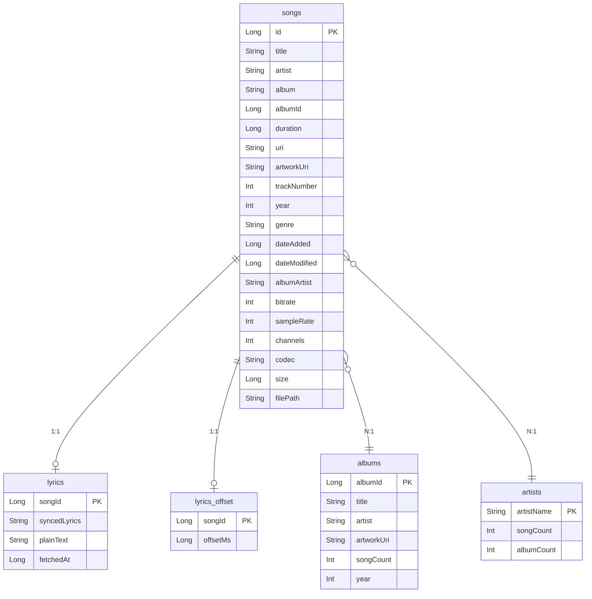

# 数据库设计

本文档描述 Muse 音乐播放器的 Room 数据库结构、实体关系和迁移策略。

## 概述

Muse 使用 Room 持久化库管理本地数据，数据库名称为 `muse_player.db`，当前版本为 3。

## 数据库结构

### 实体关系图



### 实体定义

#### SongEntity（歌曲）

```kotlin
@Entity(tableName = "songs")
data class SongEntity(
    @PrimaryKey val id: Long,
    val title: String,
    val artist: String,
    val album: String,
    val albumId: Long,
    val duration: Long,
    val uri: String,
    val artworkUri: String?,
    val trackNumber: Int,
    val year: Int?,
    val genre: String,
    val dateAdded: Long,
    val dateModified: Long,
    val albumArtist: String?,
    val bitrate: Int?,
    val sampleRate: Int?,
    val channels: Int?,
    val codec: String?,
    val size: Long,
    val filePath: String
)
```

#### AlbumEntity（专辑）

```kotlin
@Entity(tableName = "albums", primaryKeys = ["albumId"])
data class AlbumEntity(
    val albumId: Long,
    val title: String,
    val artist: String,
    val artworkUri: String?,
    val songCount: Int,
    val year: Int?
)
```

#### ArtistEntity（艺术家）

```kotlin
@Entity(tableName = "artists", primaryKeys = ["artistName"])
data class ArtistEntity(
    val artistName: String,
    val songCount: Int,
    val albumCount: Int
)
```

#### LyricsEntity（歌词）

```kotlin
@Entity(tableName = "lyrics")
data class LyricsEntity(
    @PrimaryKey val songId: Long,
    val syncedLyrics: String? = null,
    val plainText: String? = null,
    val fetchedAt: Long = System.currentTimeMillis()
)
```

#### LyricsOffsetEntity（歌词偏移）

```kotlin
@Entity(tableName = "lyrics_offset")
data class LyricsOffsetEntity(
    @PrimaryKey val songId: Long,
    val offsetMs: Long = 0L
)
```

## DAO 接口

### SongDao

```kotlin
@Dao
interface SongDao {
    @Query("SELECT * FROM songs ORDER BY title ASC")
    suspend fun getAllSongs(): List<SongEntity>

    @Query("SELECT * FROM songs WHERE id = :id")
    suspend fun getSongById(id: Long): SongEntity?

    @Query("SELECT * FROM songs WHERE title LIKE :query OR artist LIKE :query OR album LIKE :query")
    suspend fun searchSongs(query: String): List<SongEntity>

    @Query("SELECT * FROM songs WHERE album = :album ORDER BY trackNumber ASC")
    suspend fun getSongsByAlbum(album: String): List<SongEntity>

    @Query("SELECT * FROM songs WHERE artist = :artist ORDER BY album ASC, trackNumber ASC")
    suspend fun getSongsByArtist(artist: String): List<SongEntity>

    @Insert(onConflict = OnConflictStrategy.REPLACE)
    suspend fun insertAll(songs: List<SongEntity>)

    @Query("DELETE FROM songs")
    suspend fun deleteAll()

    @Query("DELETE FROM songs WHERE id = :id")
    suspend fun deleteSong(id: Long)

    @Query("SELECT COUNT(*) FROM songs")
    suspend fun getSongCount(): Int
}
```

### AlbumDao / ArtistDao

```kotlin
@Dao
interface AlbumDao {
    @Query("SELECT * FROM albums ORDER BY title ASC")
    suspend fun getAllAlbums(): List<AlbumEntity>

    @Insert(onConflict = OnConflictStrategy.REPLACE)
    suspend fun insertAll(albums: List<AlbumEntity>)

    @Query("DELETE FROM albums")
    suspend fun deleteAll()
}
```

### LyricsDao / LyricsOffsetDao

```kotlin
@Dao
interface LyricsDao {
    @Query("SELECT * FROM lyrics WHERE songId = :songId")
    suspend fun getLyrics(songId: Long): LyricsEntity?

    @Insert(onConflict = OnConflictStrategy.REPLACE)
    suspend fun insert(lyrics: LyricsEntity)

    @Query("DELETE FROM lyrics WHERE songId = :songId")
    suspend fun delete(songId: Long)
}
```

## 迁移策略

### 版本历史

| 版本 | 变更 |
|------|------|
| 1 → 2 | 添加 `lyrics` 表 |
| 2 → 3 | 添加 `lyrics_offset` 表 |

### 迁移代码

```kotlin
// Migration 1 → 2: 添加歌词表
private val MIGRATION_1_2 = object : Migration(1, 2) {
    override fun migrate(db: SupportSQLiteDatabase) {
        db.execSQL("""
            CREATE TABLE IF NOT EXISTS lyrics (
                songId INTEGER NOT NULL PRIMARY KEY,
                syncedLyrics TEXT,
                plainText TEXT,
                fetchedAt INTEGER NOT NULL DEFAULT 0
            )
        """)
    }
}

// Migration 2 → 3: 添加歌词偏移表
private val MIGRATION_2_3 = object : Migration(2, 3) {
    override fun migrate(db: SupportSQLiteDatabase) {
        db.execSQL("""
            CREATE TABLE IF NOT EXISTS lyrics_offset (
                songId INTEGER NOT NULL PRIMARY KEY,
                offsetMs INTEGER NOT NULL DEFAULT 0
            )
        """)
    }
}
```

### 迁移测试

```kotlin
@RunWith(AndroidJUnit4::class)
class MigrationTest {
    @get:Rule
    val helper = MigrationTestHelper(
        InstrumentationRegistry.getInstrumentation(),
        MuseDatabase::class.java
    )

    @Test
    fun migrate1To2() {
        helper.createDatabase("muse_player.db", 1).close()
        val db = helper.runMigrationsAndValidate(
            "muse_player.db", 2, true, MIGRATION_1_2
        )
        // 验证 lyrics 表存在
    }
}
```

### Schema 导出

Room Schema 导出到 `app/schemas/` 目录，用于迁移测试：

```kotlin
ksp {
    arg("room.schemaLocation", "$projectDir/schemas")
}
```

## 最佳实践

1. **所有迁移必须有测试**: 使用 `MigrationTestHelper` 验证
2. **Schema 导出**: 启用 `exportSchema = true` 用于版本控制
3. **冲突策略**: 使用 `OnConflictStrategy.REPLACE` 处理重复数据
4. **索引优化**: 对常用查询字段添加索引（当前查询量较小，暂未添加）

## 数据库初始化

```kotlin
@Database(
    entities = [SongEntity::class, AlbumEntity::class, ArtistEntity::class, LyricsEntity::class, LyricsOffsetEntity::class],
    version = 3,
    exportSchema = true
)
abstract class MuseDatabase : RoomDatabase() {
    abstract fun songDao(): SongDao
    abstract fun albumDao(): AlbumDao
    abstract fun artistDao(): ArtistDao
    abstract fun lyricsDao(): LyricsDao
    abstract fun lyricsOffsetDao(): LyricsOffsetDao

    companion object {
        fun getInstance(context: Context): MuseDatabase {
            return Room.databaseBuilder(
                context.applicationContext,
                MuseDatabase::class.java,
                "muse_player.db"
            )
                .addMigrations(MIGRATION_1_2, MIGRATION_2_3)
                .build()
        }
    }
}
```
