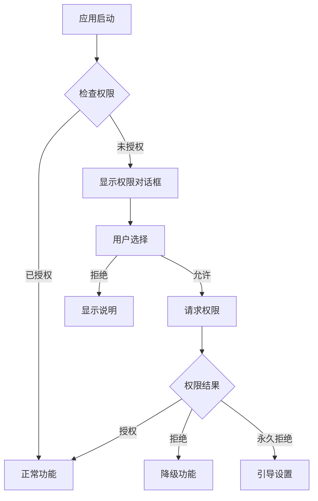

# 权限处理

本文档描述 Muse 音乐播放器的权限列表、处理流程和运行时权限策略。

## 权限列表

### AndroidManifest.xml 声明

```xml
<manifest xmlns:android="http://schemas.android.com/apk/res/android">

    <!-- 存储权限（Android 12 及以下） -->
    <uses-permission android:name="android.permission.READ_EXTERNAL_STORAGE"
        android:maxSdkVersion="32" />

    <!-- 媒体权限（Android 13+） -->
    <uses-permission android:name="android.permission.READ_MEDIA_AUDIO" />
    <uses-permission android:name="android.permission.READ_MEDIA_IMAGES" />

    <!-- 前台服务 -->
    <uses-permission android:name="android.permission.FOREGROUND_SERVICE" />
    <uses-permission android:name="android.permission.FOREGROUND_SERVICE_MEDIA_PLAYBACK" />

    <!-- 网络（歌词获取） -->
    <uses-permission android:name="android.permission.INTERNET" />

</manifest>
```

### 权限说明

| 权限 | 用途 | 运行时 | 版本要求 |
|------|------|--------|----------|
| `READ_EXTERNAL_STORAGE` | 读取音乐文件 | 是 | ≤ Android 12 |
| `READ_MEDIA_AUDIO` | 读取音频文件 | 是 | ≥ Android 13 |
| `READ_MEDIA_IMAGES` | 读取专辑封面 | 是 | ≥ Android 13 |
| `FOREGROUND_SERVICE` | 后台播放 | 否 | 全版本 |
| `INTERNET` | 歌词获取 | 否 | 全版本 |

## 权限处理流程

### 流程图



### 权限检查

```kotlin
fun hasAudioPermission(context: Context): Boolean {
    return if (Build.VERSION.SDK_INT >= Build.VERSION_CODES.TIRAMISU) {
        ContextCompat.checkSelfPermission(
            context,
            Manifest.permission.READ_MEDIA_AUDIO
        ) == PackageManager.PERMISSION_GRANTED
    } else {
        ContextCompat.checkSelfPermission(
            context,
            Manifest.permission.READ_EXTERNAL_STORAGE
        ) == PackageManager.PERMISSION_GRANTED
    }
}
```

### 权限请求

```kotlin
@Composable
fun RequestAudioPermission(
    onGranted: () -> Unit,
    onDenied: () -> Unit
) {
    val launcher = rememberLauncherForActivityResult(
        ActivityResultContracts.RequestPermission()
    ) { isGranted ->
        if (isGranted) onGranted() else onDenied()
    }

    LaunchedEffect(Unit) {
        val permission = if (Build.VERSION.SDK_INT >= Build.VERSION_CODES.TIRAMISU) {
            Manifest.permission.READ_MEDIA_AUDIO
        } else {
            Manifest.permission.READ_EXTERNAL_STORAGE
        }
        launcher.launch(permission)
    }
}
```

## 运行时权限

### 权限对话框

```kotlin
@Composable
fun StoragePermissionDialog(
    onRequestPermission: () -> Unit,
    onDismiss: () -> Unit
) {
    AlertDialog(
        onDismissRequest = onDismiss,
        title = { Text("需要存储权限") },
        text = { Text("为了扫描和播放本地音乐，应用需要访问存储的权限。") },
        confirmButton = {
            TextButton(onClick = onRequestPermission) {
                Text("授予权限")
            }
        },
        dismissButton = {
            TextButton(onClick = onDismiss) {
                Text("稍后再说")
            }
        }
    )
}
```

### 权限状态处理

```kotlin
@Composable
fun HomeScreen(
    hasPermission: Boolean,
    onRequestPermission: () -> Unit
) {
    if (hasPermission) {
        // 显示正常内容
        MusicContent()
    } else {
        // 显示权限请求界面
        PermissionRequiredContent(
            onRequestPermission = onRequestPermission
        )
    }
}
```

### 永久拒绝处理

当用户选择"不再询问"时，引导用户前往设置：

```kotlin
fun openAppSettings(context: Context) {
    val intent = Intent(Settings.ACTION_APPLICATION_DETAILS_SETTINGS).apply {
        data = Uri.fromParts("package", context.packageName, null)
    }
    context.startActivity(intent)
}
```

## Android 版本适配

### Android 13+ (API 33+)

- 使用细粒度媒体权限
- `READ_MEDIA_AUDIO` 替代 `READ_EXTERNAL_STORAGE`
- 不需要 `READ_MEDIA_IMAGES`（封面通过 ContentUri 访问）

### Android 12 (API 31-32)

- 使用 `READ_EXTERNAL_STORAGE`
- 需要处理权限撤销

### Android 11 及以下

- 使用 `READ_EXTERNAL_STORAGE`
- 支持运行时权限模型

## 最佳实践

1. **最小权限原则**: 只请求必要的权限
2. **优雅降级**: 权限拒绝时提供替代功能
3. **清晰说明**: 向用户解释权限用途
4. **及时检查**: 在功能使用前检查权限
5. **尊重选择**: 不重复请求已拒绝的权限

## 权限相关文件

```
app/src/main/java/luzzr/muse/
├── ui/
│   └── screens/
│       └── library/
│           └── dialogs/
│               └── StoragePermissionDialog.kt
└── MainActivity.kt  # 权限请求入口
```
